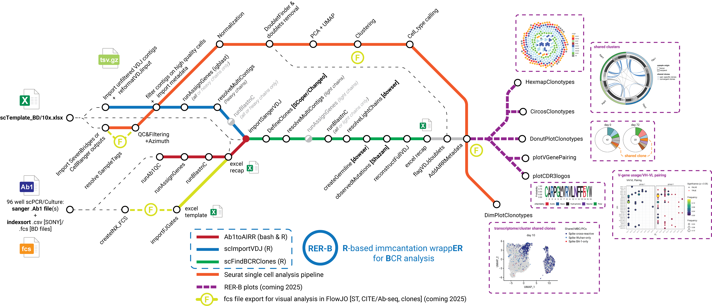

# RERB

RER-B is an **R**-based wrapp**ER** for the analysis of single-cell **B**CR repertoires using the immcantation pipeline (TCR may come at some point...). It is designed to deal with mixed data from 10X or BD Rhapsody-based scVDJ_seq data as well as plate-based Sanger VDJ sequencing (see also Ab1toAIRR). RER-B is primarily designed to work with seurat objects and incorporates a few handy functions for smooth interfacing. Initial QC (filtering on features/mitochondrial genes) should have been performed before and will be used for the initial filtering of scVDJ_seq-derived VDJ contigs. Initial reference mapping using azimuth can also be used at the end of the pipeline to flag doublets using observed VDJ contigs in cells (flagVDJdoublets). RER-B is also intended for use with plate-based VDJ sequencing data and provides a few tools to work with index-sorting data (both BD ARIAs and SONY MA900 cell sorters and FlowJo analysis exports for now...). It is compatible with most plotting options from the immcantation pipeline and also incorporates dedicated plotting options (coming soon...). Of note, RER-B provides two wrappers (**scImportVDJ( )** and **scFindBCRClones( )**) described below, but all functions listed in the figure below can be used separately from one another.

 **Figure1:** RER-B pipeline

## How to install:

1.  Install first standalone versions of **blast** and **igblast** (on MACOS, use the latest .dmg files that can be downloaded here: <https://ncbi.github.io/igblast/cook/How-to-set-up.html> here: <https://blast.ncbi.nlm.nih.gov/doc/blast-help/downloadblastdata.html>)

2.  Install **Immcantation ChangeO** package (<https://changeo.readthedocs.io/en/stable/examples/igblast.html>) and make sure the AssignGenes and MakeDb scripts are in a folder that is in your PATH or add it to your PATH. On MACOS:

``` bash
echo 'export PATH="$HOME/Library/Python/your_version/bin:$PATH"' >> ~/.zshrc
source ~/.zshrc
```

3.  Create a blastable IMGT database as define here (<https://changeo.readthedocs.io/en/stable/examples/igblast.html>) and create a BLASTable C gene database from the igblast imgt database by running the "Create_IMGT_human_IG_C_Blastdb.R" R script in R. Alternatively, simply create a \~/share/ folder and copy the provided "igblast" and "germline" folders (inside the **RERB/inst/extdata/imgt_database** folder) into it.

4.  Install the following R packages:

core required packages:
``` r
install.packages("tidyverse", "shazam", "alakazam", "scoper", "dowser", "sangeranalyseR") 
if (!require("BiocManager", quietly = TRUE))
    install.packages("BiocManager")
BiocManager::install("Biostrings")
```
additional packages for parallel computing, plotting and recap options:
``` r
install.packages("parallel", "openxlsx", "patchwork", "scales", "circlize", "ggforce", "ggrepel", "ggseqlogo", "gridExtra", "sangerseqR", "packcircles", "RColorBrewer") 
if (!require("BiocManager", quietly = TRUE))
    install.packages("BiocManager")
BiocManager::install("ComplexHeatmap")
```

5.  Download the "RERB" package to a folder of your choice and load the package using devtools:
``` r
devtools::load_all("~/path_to_the_folder/RERB")
```

## How to use it:

load RERB:
``` r
devtools::load_all("~/path_to_the_folder/RERB")
```

**Option 1: Working with BD Rhapsody or 10x data (fill in the associated excel template):** Load seurat object and if not defined before, define cell_id in seurat metadata (cell_id should match the ones used for VDJ contigs). **scImportVDJ()** can be used with both full seurat object or metadata (to save up on memory).

``` r
library(Seurat)
setwd("path_to_your_analysis folder")
seurat <- LoadSeuratRds("your_seurat_object.Rds")
seurat$cell_id <- colnames(seurat)
meta_BD <- seurat[[]]
```

You can then run the first step of the pipeline: import and QC of VDJ data from filtered or unfiltered VDJ contigs.

-   The two key arguments are **seurat** (full seurat or metadata) and **vdj_files** (a dataframe with the following columns:"sample_id" and "full_path" or "directory"+"filename_vdj"). You can use the associated excel templates.

-   The **split.by** argument is used here at the IGH filtering step to learn the expected VDJ read distribution at the library level, should be a provided column in the metadata.

-   If you have run azimuth before, you can import the resulting cell labels using the **import_from_seurat** argument.

-   To use 10X data, simply use tech = "10X", providing the right technology argument is used to modify accordingly the colnames of imported datasets.

``` r
recap_scVDJ_BD <- openxlsx::read.xlsx("scTemplate_BDRhapsody_v1.0.xlsx", sheet="scRNA-seq", rowNames = FALSE)
analysis_name_BD <- "PC_HD"
tech <- "BD"

VDJ_db <- scImportVDJ(seurat = meta_BD, 
                      vdj_files = recap_scVDJ_BD, 
                      analysis_name = analysis_name_BD,
                      import_from_seurat = c("donor_id", "tissue", "cartridge", "predicted.celltype.l1", "predicted.celltype.l1.score"),
                      tech = tech, 
                      split.by = "cartridge")
```

You can also import additional plate-based Sanger sequencing data using **ImportSangerVDJ()** (data should be in an AIRR format, use the Ab1toAIRR pipeline for that). As for **scImportVDJ()**, the main argument is sanger_files (a dataframe with the following columns:"sample_id" and "full_path" or "directory"+"filename_vdj"). You can use the associated excel templates.

``` r
recap_scSanger <- openxlsx::read.xlsx("scTemplate_BDRhapsody_v1.0.xlsx", sheet="scSangerBCR-seq", rowNames = FALSE)                     
VDJ_db <- ImportSangerVDJ(db = VDJ_db, sanger_files = recap_scSanger)
```

You can then run the second step of the pipeline: find clones based on heavy chain first and then filter light chain multiplets, filter clones based on light chains, reconstruct germline alignments based on clones, calculate mutation loads and reconstruct full contigs to use in AlphaFold3 for example.

-   Possible **method** for defining clones is "changeo" (using DefineClones.py from Changeo) or one of "identical"/"hierarchical"/"spectral" (using Scoper package). By default the hierarchical method is used and two thresholds are tested (0.12 and 0.15). You can also fix an alternative threshold using the **threshod** argument. The final clone_id will always be defined based on the last tested threshold (default being 0.15) but all other clustering results will be outputted ("h_clone_id_used_threshold" columns).

-   The **split.by** argument is used here at IGL/IGK filtering step to learn the expected VDJ read distribution at the library level. It should be a provided column in the metadata.

``` r
cloned_VDJ_db <- scFindBCRClones(VDJ_db, analysis_name = analysis_name_BD, method = "changeo", split.by = "cartridge")
```

You can also flag potential homotypic (B/B) and heterotypic (B/nonB) doublets based on VDJ contigs and azimuth calls.

-   to simply flag homotypic doublets (2 heavy and 2 lights chains at a number of read expected based on overall distribution in the library)

``` r
cloned_VDJ_db <- flagVDJdoublets(cloned_VDJ_db, analysis_name = analysis_name_BD, split.by = "cartridge", heterotypic = FALSE)
```

-   to flag both homotypic (B/B) and heterotypic (B/non-B) doublets (1 heavy and 1 lights chain at a number of read expected based on overall distribution in the library but in a cell not labelled as a B cell by azimuth, use the **azimuth.ref** argument to point to the reference you used when running azimuth (<https://azimuth.hubmapconsortium.org/references/>). For now RER-B is automatically set-up to work with the following references: "pbmcref", "tonsilref" and "bonemarrowref"). If using another one, you will need to provide additional info using the **azimuth.column** (which level to use) and **azimuth.Bcelltypes** (which clusters correspond to B cells) arguments.

``` r
cloned_VDJ_db <- flagVDJdoublets(cloned_VDJ_db, analysis_name = analysis_name_BD, split.by = "cartridge", ref = "azimuth.bonemarrowref")
```

Finally, you can import all VDJ metadata into your seurat object:

``` r
seurat <- addAIRRmetadata(seurat, cloned_VDJ_db, type = "BCR", split.by = "donor_id")
```

Of note, the **split.by** argument is used here to calculate the size and frequencies of clones at the sample level (donor level here), likely different from the cartridge/library level used in prior steps.

**Option 2: If you only have plate-based Sanger sequencing data:** The pipeline is the same, simply starting at the **ImportSangerVDJ()** step and adding the **only_heavy = TRUE** argument in **scFindBCRClones()**. If working with index-sort data you can also import FlowJo gating data in between the two steps using the **ImportFJGates()** function (can be done before or after clonal analysis).
``` r
recap_scSanger <- openxlsx::read.xlsx("Recap_sorts_MPOX_01042025.xlsx", sheet="scSangerBCR-seq", rowNames = FALSE)
recap_FJ <- openxlsx::read.xlsx("Recap_sorts_MPOX_01042025.xlsx", sheet="FlowJo_exports", rowNames = FALSE)

VDJ_db <- ImportSangerVDJ(recap_scSanger, orig.ident = "sanger_plate_id")
VDJ_db <- ImportFJGates(recap_FJ, VDJ_db)
cloned_VDJ_db <- scFindBCRClones(VDJ_db, analysis_name = "All_seq_MPOX", only_heavy = TRUE)
```

if you want to create dedicated worksheets in the final recap table on a particular value (here "specificity"), just use the **recap.highlight** argument:

``` r
cloned_VDJ_db <- scFindBCRClones(VDJ_db, analysis_name = "All_seq_MPOX", only_heavy = TRUE, recap.highlight = "specificity")
```

**Option 3: If you only have a table with a raw sequence column** In this case you need to run igblast first using the **run_igblast()** function, indicating which column to use as sequence_id (should be a unique identifier). Below is an example were you import a excel table with only two columns with the following headers: "my_ids" and "my_sequences", with the data in the first worksheet and no blank rows or columns above or left of you data. Set output = TRUE only if you want to keep all intermediate results from igblast.

``` r
setwd("path to your file/")
simple_db <- openxlsx::read.xlsx("your_table.xlsx", sheet="1", rowNames = FALSE)
igblast_results <- run_igblast(simple_db, sequence = "my_sequences", sequence_id = "my_ids", output = TRUE)
```

then you can run **scFindBCRClones()**, adding **only_heavy = TRUE** if you only have heavy chain sequences.

``` r
cloned_VDJ_db <- scFindBCRClones(igblast_results[["pass"]], only_heavy = TRUE)
```

all intermediate and final results files will be stored inside the "path to your file/" folder.

**Plotting Options:** [under construction...]

-   **Donut plots**:

The **DonutPlotClonotypes3D()** function offers a flexible way to plot donut plots grouping data on multiple variables, well adapted to small repertoire sizes. By default, DonutPlotClonotypes3D() highlights shared clones (**highlight** = "shared") between groups. Below is an example where data is grouped first on donor_id and then time_point, and shared clones between time-points for individual donors are being highlighted (same color).

-   The **external_bar** argument can be "none", "expanded" or "top5".

-   The **highlight** argument can be "shared", "clone_size" or "clone_rank".

-   The **split.by** argument is use to split the data set in as many group as needed. In the below argument one plot will be automatically made for each time point in each donor. When using **highlight** = "shared", the last listed split.by argument, here "time_point", will be used to look for clonal relationship (here between time points for each given donor). When using other **highlight** arguments, all columns provided in the **split.by** argument are used for grouping and clone sizes/ranks are calculated inside each individual repertoires.

-   **prefix** can be set to whatever you want it to be.

``` r
DonutPlotClonotypes(cloned_VDJ_db, 
                    split.by = c("donor_id", "time_point"),
                    highlight = "shared",
                    prefix = "all",
                    plots_folder = "VDJ_Clones/Donut_plots",
                    external_bar = "none")
```

-   **Hexbin plots**:

The **HexmapClonotypes()** function offers a way to plot repertoire data as hexbin or circles, similar to the honeycomb plots in 10X enclone software or here for a similar python implementation: (<https://github.com/michael-swift/Bcell_memory_formation>); shape can be "hex" or "circle". It is better adapted to big repertoires.

-   The **highlight** argument points to the column to be use to color each hex or circle.

-   The **split.by** argument is use to split the data set in as many group as needed. In the below argument one plot will be automatically made for each celltype in each sample ("orig.ident").

-   As for DonutPlotClonotypes(), a **prefix** argument can be set to whatever you want it to be in the final naming of the plots.

``` r
HexmapClonotypes(cloned_VDJ_db, highlight = "c_call", split.by = c("orig.ident", "predicted.celltype.l2"))
```

## Guide to final "full_recap.xlsx" file:

In addition to the classical columns outputted by igblast and Immcantation packages (AIRR format) and the columns imported from the user provided data frames, the following columns will be created:

-   assay: one of "10X", "BD" (**tech** argument), "scPCR" or "scCulture", defining the origin of the data.

-   bcr_info: one of "full" (if both heavy and light contigs are found for a given cell_id), "heavy_only" or "light_only".

-   clone_id: final clone attribution based on the last threshold used for heavy chain clustering and, eventually, light chain correction.

-   h_clone_id_0.X(s): results of the initial heavy chain clustering (by default **scoper::hierarchicalClones()** and two thresholds: 0.12 and 0.15).

-   l_subgroup_h_clone_id_0.X: results of the corrected clonal clustering (**dowser::resolveLightChains()**) using additional light chain information when available (by default uses the clone_id defined during the initial heavy chain-based clonal clustering).

-   c_call and c_call_igblast; c_call correspond to the output of our homemade Blastn pipeline to call c gene (with no more selection based on alignment length, instead multiple calls are return, i.e. IGHG1\|IGHG2\|IGHG3); c_call_igblast correspond to the output of igblast.

-   full_sequence: reconstructed full sequence in nucleotide format, with missing beginning of V and end of J reverted to germline;

-   full_sequence_aa: reconstructed full sequence in amino-acid format, with missing beginning of V and end of J reverted to germline;

-   full_sequence_fab_aa: reconstructed full sequence in amino-acid format with added CH1 domain from identified constant region, with missing beginning of V and end of J reverted to germline;

-   comments: comments on the full sequence reconstruction.

-   expanded_clone: whether clone is seen more then once.

-   shared_clone: whether clone is shared between different technologies (10x and plate-Based scPCR for example). Usefull to check for specific cells in the scRNA-seq data sets based on specific MBCs plate-based single-cell and VDJ sequencing.

Also export all intermediate files (including sequences that fail **igblast** or **dowser::createGermlines()** steps) and a couple of QC graphs, by default inside **VDJ_QC/** (scImportVDJ()) and **VDJ_Clones** (scFindBCRClones()). This includes library-level density plots for IGH and IGK/L reads (pre and post-filtering), VDJ doublets QC plots (B and nonB) and clustering QC plots as generated by scoper.


## Citation:

If using it please consider citing the core papers at the basis of the immcantation pipeline :

To cite the alakazam, SHazaM and ChangeO packages in publications, please use:

Gupta N, Vander Heiden J, Uduman M, Gadala-Maria D, Yaari G, Kleinstein S (2015). “Change-O: a toolkit for analyzing large-scale B cell immunoglobulin repertoire sequencing data.” Bioinformatics, 1-3. <doi:10.1093/bioinformatics/btv359> <https://doi.org/10.1093/bioinformatics/btv359>.

To cite the scoper package or spectral clustering-based model in publications, please use:

Nouri N, Kleinstein S (2018). “A spectral clustering-based method for identifying clones from high-throughput B cell repertoire sequencing data.” Bioinformatics, i341-i349. <doi:10.1093/bioinformatics/bty235> <https://doi.org/10.1093/bioinformatics/bty235>.

Nouri N, Kleinstein S (2020). “Somatic hypermutation analysis for improved identification of B cell clonal families from next-generation sequencing data.” PLOS Computational Biology, 16(6), e1007977. <doi:10.1371/journal.pcbi.1007977> <https://doi.org/10.1371/journal.pcbi.1007977>.

To cite the hierarchical clustering-based model in publications, please use:

Gupta N, Adams K, Briggs A, Timberlake S, Vigneault F, Kleinstein S (2017). “Hierarchical clustering can identify B cell clones with high confidence in Ig repertoire sequencing data.” The Journal of Immunology, 2489-2499. <doi:10.4049/jimmunol.1601850> <https://doi.org/10.4049/jimmunol.1601850>.

To cite the dowser package in publications, please use

Hoehn K, Pybus O, Kleinstein S (2022). “Phylogenetic analysis of migration, differentiation, and class switching in B cells.” PLoS Computational Biology. <doi:10.1371/journal.pcbi.1009885> <https://doi.org/10.1371/journal.pcbi.1009885>, <https://doi.org/10.1371/journal.pcbi.1009885>.

If you use the correlationTest function for measurable evolution, please also cite

Hoehn K, Turner J, Miller F, Jiang R, Ellebedy A, Pybus O, Kleinstein S (2021). “Human B cell lineages associated with germinal centers following influenza vaccination are measurably evolving.” eLife. <doi:10.7554/eLife.70873> <https://doi.org/10.7554/eLife.70873>, <https://elifesciences.org/articles/70873>.

If you construct paired heavy and light chain trees, please also cite

Jensen C, Sumner J, Kleinstein S, Hoehn K (2024). “Inferring B Cell Phylogenies from Paired H and L Chain BCR Sequences with Dowser.” The Journal of Immunology. <doi:10.4049/jimmunol.2300851> <https://doi.org/10.4049/jimmunol.2300851>, <https://doi.org/10.4049/jimmunol.2300851>.

If you additionally use IgPhyML for building trees please also cite

Hoehn K, Van der Heiden J, Zhou J, Lunter G, Pybus O, Kleinstein S (2019). “Repertoire-wide phylogenetic models of B cell molecular evolution reveal evolutionary signatures of aging and vaccination.” PNAS. <doi:10.1073/pnas.1906020116> <https://doi.org/10.1073/pnas.1906020116>, <https://doi.org/10.1073/pnas.1906020116>.
